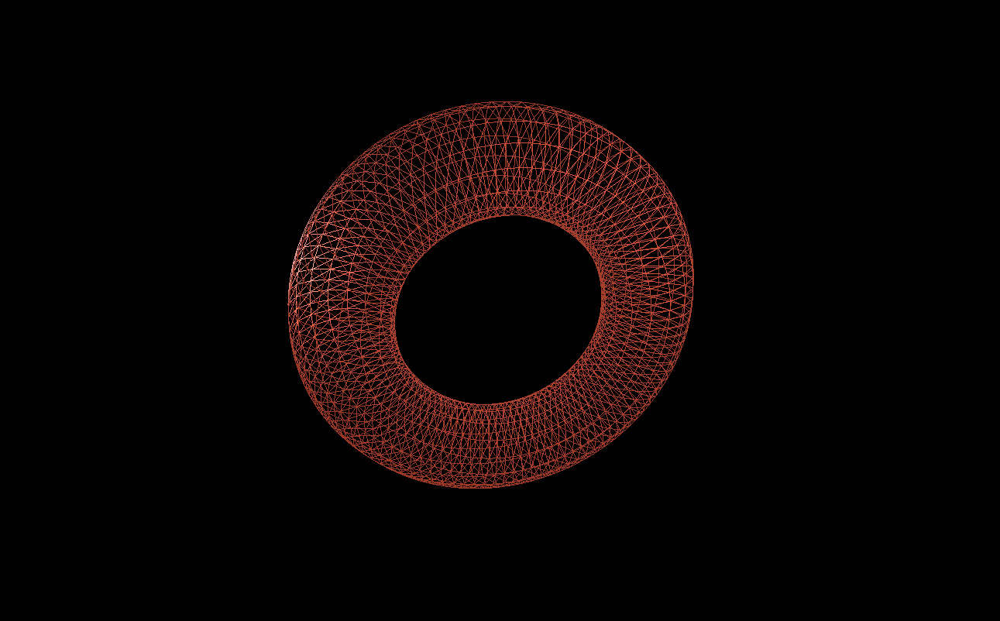
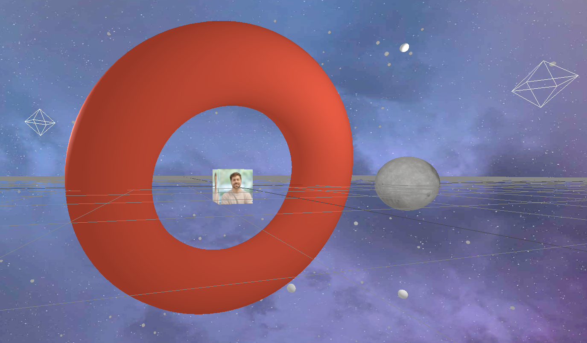
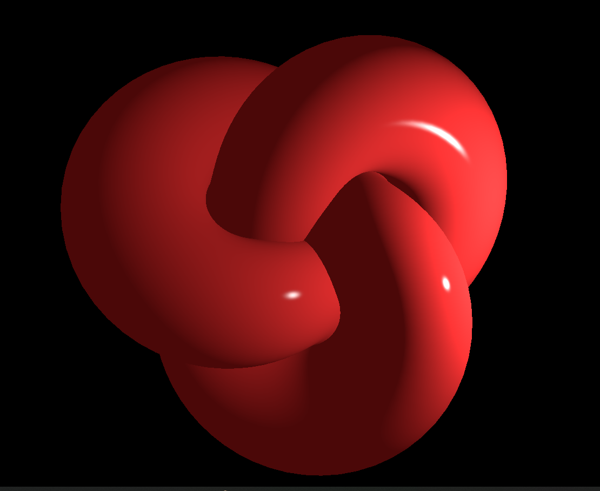
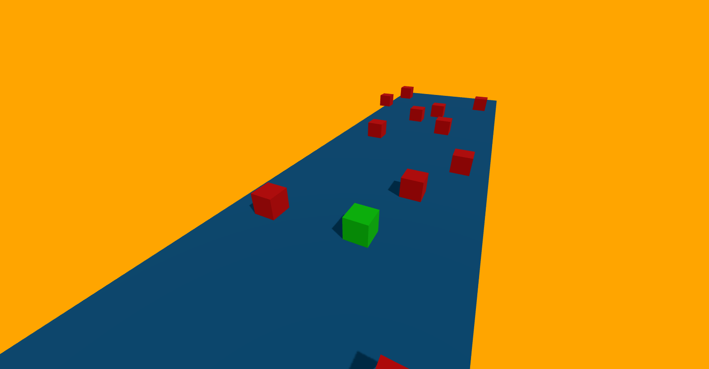

# Three.js SRP

Ik wil mijn met mijn SRP graag gaan leren over [Three.js](https://threejs.org/).

## Introductie

Doordat ik mij wil focussen op frontend development ben ik veel bezig geweest met code ben ik de verschillende technieken erg interessant gaan vinden. Daarnaast heb ik een fascinatie voor 3d modeleren en heb hier eerder een SRP over gedaan en een keuzevak gevolgd. Ik heb hier dus al wat ervaring mee. Ik wil dus bij deze SRP die twee dingen combineren en dat gaat perfect met Three.js. Dit is namelijk een JavaScript library die gebruikt wordt geanimeerde 3D-computergraphics te maken en weer te geven in een webbrowser met behulp van WebGL.

### Studieplan

Ik wil beginnen met een [tutorial](https://youtu.be/Q7AOvWpIVHU?si=e1vwXO631DTF9ql2) op Youtube volgen om de basis te leggen met het begrijpen hoe Three.js werkt. Tijdens het werken hieraan hoop ik inspiratie te krijgen over wat ik uiteindelijk wil gaan maken als SRP project. Terwijl ik hieraan werkIk heb een planning gemaakt waar ik mij aan ga houden:

| Wanneer ga wat doen? | Weeknr | Aantal uren |
| -------------------- | ------ | ----------- |
| Tutorial volgen      | 46     | 8           |
| Werken aan project   | 47     | 8           |
| Werken aan project   | 48     | 8           |
| Documentatie         | 49     | 4           |

<details>
<summary>Week 1</summary>

Deze week staat in het teken van de eerste zetten met Three.js. Ik ging aan de slag met de tutorial om een beter idee te krijgen hoe three.js werkt en wat er allemaal mogelijk is met deze tool. De tutorial neemt je mee met het maken van een paar simpele vormen en legt een aantal basisdingen uit van Three.js.

- Het aanmaken van je canvas
- Scene, camera en renderengine instellen
- Je eerste 3d geometrie aanmaken
- Verschillende soorten lichten instellen voor je scene
- Helpers zoals grids en lichthelpers
- Functions voor het random scatteren van objecten
- Textures, backgrounds en materials instellen
- (Scroll)animaties instellen

Eerste "torus" aangemaakt.


Animatie gegeven, achtergrond voor het canvas, kubus met eigen texture en Sphere met texture van de maan.


<details>
<summary>Code na de tutorial:</summary>

```javascript
import "./style.css";
import * as THREE from "three";

// Controlls om in de browser te kunnen bewegen met de muis
import { OrbitControls } from "three/examples/jsm/controls/OrbitControls";

// Setup

const scene = new THREE.Scene();

const camera = new THREE.PerspectiveCamera(
  75,
  window.innerWidth / window.innerHeight,
  0.1,
  1000
);

const renderer = new THREE.WebGLRenderer({
  canvas: document.querySelector("#bg"),
});

renderer.setPixelRatio(window.devicePixelRatio);
renderer.setSize(window.innerWidth, window.innerHeight);
camera.position.setZ(30);
camera.position.setX(-3);

renderer.render(scene, camera);

// Torus

const geometry = new THREE.TorusGeometry(10, 3, 16, 100);
const material = new THREE.MeshStandardMaterial({ color: 0xff6347 });
const torus = new THREE.Mesh(geometry, material);

scene.add(torus);

// Lights

const pointLight = new THREE.PointLight(0xffffff);
pointLight.position.set(5, 5, 5);

const ambientLight = new THREE.AmbientLight(0xffffff);
scene.add(pointLight, ambientLight);

// Helpers

// const lightHelper = new THREE.PointLightHelper(pointLight)
// const gridHelper = new THREE.GridHelper(200, 50);
// scene.add(lightHelper, gridHelper)

// const controls = new OrbitControls(camera, renderer.domElement);

// Functie om sterren random te verspreiden
function addStar() {
  const geometry = new THREE.SphereGeometry(0.25, 24, 24);
  const material = new THREE.MeshStandardMaterial({ color: 0xffffff });
  const star = new THREE.Mesh(geometry, material);

  const [x, y, z] = Array(3)
    .fill()
    .map(() => THREE.MathUtils.randFloatSpread(100));

  star.position.set(x, y, z);
  scene.add(star);
}

Array(200).fill().forEach(addStar);

// Background

const spaceTexture = new THREE.TextureLoader().load("img/space.jpg");
scene.background = spaceTexture;

// Avatar

const HiddeTexture = new THREE.TextureLoader().load("img/bold.jpg");

const hidde = new THREE.Mesh(
  new THREE.BoxGeometry(3, 3, 3),
  new THREE.MeshBasicMaterial({ map: HiddeTexture })
);

scene.add(hidde);

// Moon

const moonTexture = new THREE.TextureLoader().load("img/moon.jpg");
const normalTexture = new THREE.TextureLoader().load("img/normal.jpg");

const moon = new THREE.Mesh(
  new THREE.SphereGeometry(3, 32, 32),
  new THREE.MeshStandardMaterial({
    map: moonTexture,
    normalMap: normalTexture,
  })
);

scene.add(moon);

moon.position.z = 30;
moon.position.setX(-10);

jeff.position.z = -5;
jeff.position.x = 2;

// Scroll Animation

function moveCamera() {
  const t = document.body.getBoundingClientRect().top;
  moon.rotation.x += 0.05;
  moon.rotation.y += 0.075;
  moon.rotation.z += 0.05;

  jeff.rotation.y += 0.01;
  jeff.rotation.z += 0.01;

  camera.position.z = t * -0.01;
  camera.position.x = t * -0.0002;
  camera.rotation.y = t * -0.0002;
}

document.body.onscroll = moveCamera;
moveCamera();

// Animation Loop

function animate() {
  requestAnimationFrame(animate);

  torus.rotation.x += 0.01;
  torus.rotation.y += 0.005;
  torus.rotation.z += 0.01;

  moon.rotation.x += 0.005;

  // controls.update();

  renderer.render(scene, camera);
}

animate();
```

</details>
</details>
<details>
  <summary>Week 2</summary>
  Deze week wil ik gaan starten met het maken van mijn project. Ik ga eerst inspiratie opdoen voor een cool idee om te maken. Het moet natuurlijk ook haalbaar zijn voor mijn niveau en moet binnen de tijd dusdanig af zijn om beoordeeld te kunnen worden.Als eerst ben ik nog een beetje gaan experimenteren met de verschillende vormen en materialen die je kan gebruiken. Ik heb toen dit gemaakt:
  
  
  Met deze code:

```javascript
const geometry = new THREE.TorusKnotGeometry(10, 5, 200, 100);
const material = new THREE.MeshPhongMaterial({
  color: "firebrick",
  shininess: 1000,
});
const torus = new THREE.Mesh(geometry, material);

scene.add(torus);

const pointLight = new THREE.PointLight(0xffffff, 2000);
pointLight.position.set(20, 0, 15);

const ambientLight = new THREE.AmbientLight(0xffffff, 0.5);

scene.add(pointLight, ambientLight);
```

Ook ben ik een idee tegen gekomen om aan te werken, ik wil namelijk een game gaan maken. Ik kwam op dat idee door deze [tutorial](https://www.youtube.com/watch?v=sPereCgQnWQ) die gaat over het maken van een simpel ontwijk spelletje in three.js. Ik wil uit deze tutorial leren hoe je een werkende game kan maken en daar mijn eigen draai aan geven.
<details>
  <summary>Met deze tutorial heb ik deze code geschreven:</summary>
  
```javascript
import "./style.css";
import * as THREE from "three";
import { OrbitControls } from "three/examples/jsm/controls/OrbitControls";

const scene = new THREE.Scene();

const camera = new THREE.PerspectiveCamera(
  75,
  window.innerWidth / window.innerHeight,
  0.1,
  1000
);

const renderer = new THREE.WebGLRenderer({
  canvas: document.querySelector("#bg"),
  alpha: true,
  antialias: true,
});
scene.background = new THREE.Color("orange");
renderer.shadowMap.enabled = true;
renderer.setPixelRatio(window.devicePixelRatio);
renderer.setSize(window.innerWidth, window.innerHeight);
camera.position.setZ(8);
camera.position.setX(4);
camera.position.setY(5);

class Box extends THREE.Mesh {
  constructor({
    width,
    height,
    depth,
    color = "#00ff00",
    velocity = { x: 0, y: 0, z: 0 },
    position = {
      x: 0,
      y: 0,
      z: 0,
    },
    zAcceleration = false,
  }) {
    super(
      new THREE.BoxGeometry(width, height, depth),
      new THREE.MeshStandardMaterial({ color })
    );

    this.width = width;
    this.height = height;
    this.depth = depth;

    this.position.set(position.x, position.y, position.z);

    this.right = this.position.x + this.width / 2;
    this.left = this.position.x - this.width / 2;

    this.bottom = this.position.y - this.height / 2;
    this.top = this.position.y + this.height / 2;

    this.front = this.position.z + this.depth / 2;
    this.back = this.position.z - this.depth / 2;

    this.velocity = velocity;
    this.gravity = -0.005;
    this.zAcceleration = zAcceleration;
  }

  updateSides() {
    this.right = this.position.x + this.width / 2;
    this.left = this.position.x - this.width / 2;

    this.bottom = this.position.y - this.height / 2;
    this.top = this.position.y + this.height / 2;

    this.front = this.position.z + this.depth / 2;
    this.back = this.position.z - this.depth / 2;
  }

  update(ground) {
    this.updateSides();
    if ((this.zAcceleration = true)) {
      this.velocity.z += 0.001;
    }

    this.position.x += this.velocity.x;
    this.position.z += this.velocity.z;

    this.applyGravity(ground);
  }

  applyGravity(ground) {
    this.velocity.y += this.gravity;

    if (
      boxCollision({
        box1: this,
        box2: ground,
      })
    ) {
      this.velocity.y *= 0.5;
      this.velocity.y = -this.velocity.y;
    } else this.position.y += this.velocity.y;
  }
}

function boxCollision({ box1, box2 }) {
  const xCollision = box1.right >= box2.left && box1.left <= box2.right;
  const yCollision =
    box1.bottom + box1.velocity.y <= box2.top && box1.top >= box2.bottom;
  const zCollision = box1.front >= box2.back && box1.back <= box2.front;

  return xCollision && zCollision && yCollision;
}

const cube = new Box({
  width: 1,
  height: 1,
  depth: 1,
  color: 0x00ff00,
  velocity: {
    x: 0,
    y: 0,
    z: 0,
  },
  position: {
    x: 0,
    y: 1,
    z: 0,
  },
  zAcceleration: false,
});
cube.castShadow = true;
scene.add(cube);

const ground = new Box({
  width: 10,
  height: 0.5,
  depth: 50,
  color: "#0369a1",
  position: {
    x: 0,
    y: -2,
    z: 0,
  },
});

ground.receiveShadow = true;
scene.add(ground);

const light = new THREE.DirectionalLight(0xffffff, 1);
light.position.y = 3;
light.position.x = 2;
light.position.z = 1;
light.castShadow = true;
scene.add(light);

scene.add(new THREE.AmbientLight(0xffffff, 0.5));

const controls = new OrbitControls(camera, renderer.domElement);

const keys = {
  a: {
    pressed: false,
  },
  d: {
    pressed: false,
  },
  w: {
    pressed: false,
  },
  s: {
    pressed: false,
  },
};

window.addEventListener("keydown", (event) => {
  switch (event.code) {
    case "KeyA":
      keys.a.pressed = true;
      break;
    case "KeyD":
      keys.d.pressed = true;
      break;
    case "KeyW":
      keys.w.pressed = true;
      break;
    case "KeyS":
      keys.s.pressed = true;
      break;
    case "Space":
      cube.velocity.y = 0.15;
      break;
  }
});

window.addEventListener("keyup", (event) => {
  switch (event.code) {
    case "KeyA":
      keys.a.pressed = false;
      break;
    case "KeyD":
      keys.d.pressed = false;
      break;
    case "KeyW":
      keys.w.pressed = false;
      break;
    case "KeyS":
      keys.s.pressed = false;
      break;
  }
});

const enemies = [];

let frames = 0;
let spawnRate = 200;
function animate() {
  const animationId = requestAnimationFrame(animate);
  //movement code

  cube.velocity.x = 0;
  cube.velocity.z = 0;
  if (keys.a.pressed) cube.velocity.x = -0.05;
  else if (keys.d.pressed) cube.velocity.x = 0.05;

  if (keys.w.pressed) cube.velocity.z = -0.05;
  else if (keys.s.pressed) cube.velocity.z = 0.05;

  cube.update(ground);
  enemies.forEach((enemy) => {
    enemy.update(ground);
    if (
      boxCollision({
        box1: cube,
        box2: enemy,
      })
    ) {
      window.cancelAnimationFrame(animationId);
    }
  });

  if (frames % spawnRate === 0) {
    if (spawnRate > 20) {
      spawnRate -= 20;
    }
    const enemy = new Box({
      width: 1,
      height: 1,
      depth: 1,
      color: 0xff0000,
      velocity: {
        x: 0,
        y: 0,
        z: 0.01,
      },
      position: {
        x: (Math.random() - 0.5) * 10,
        y: 0,
        z: -20,
      },
      zAcceleration: true,
    });
    enemy.castShadow = true;
    scene.add(enemy);
    enemies.push(enemy);
    console.log(enemy.position.x);
  }

  frames++;
  controls.update();
  renderer.render(scene, camera);
}

animate();

```

</details>
Het uitendelijke gemaakte spel gaat dus om het ontwijken van de rode boxen. Je hebt controle over de groene. Ik heb nu geleerd hoe je allemaal elementen van een game zelf kan bouwen. Hier een lijstje van dingen die terugkomen in deze tutorial:
- Gravity
- Collision
- Velocity
- Position


</details>
